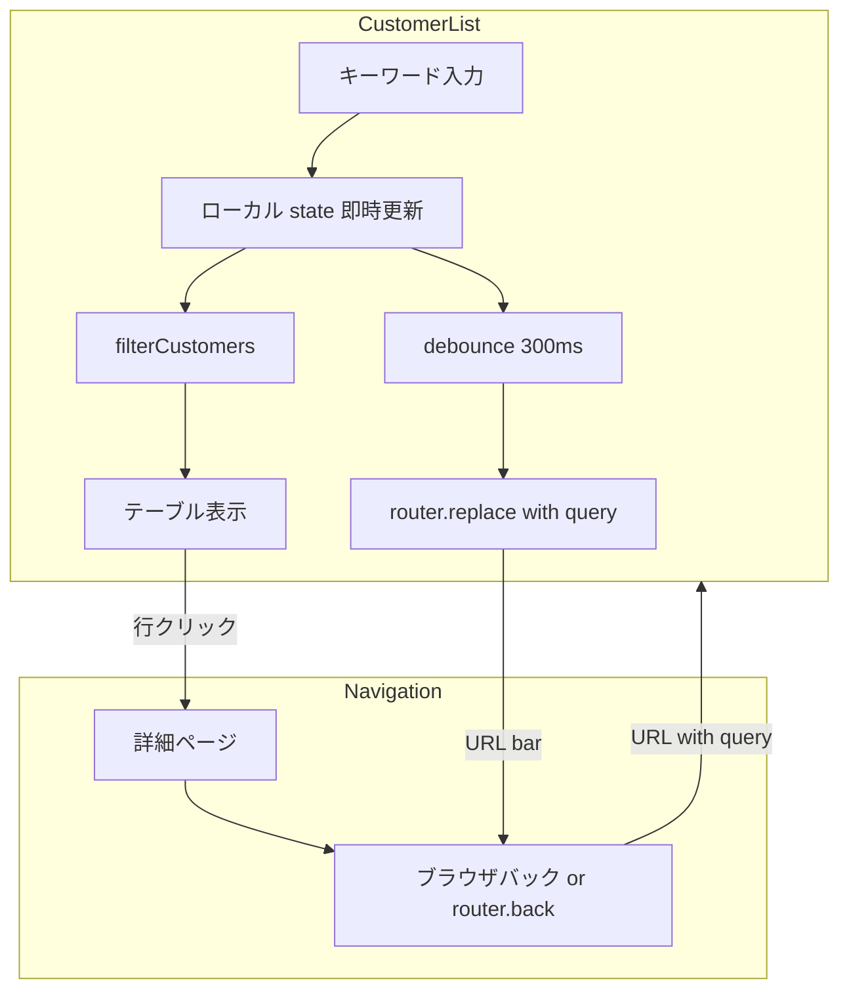

# 顧客一覧フィルター URL 同期 実装計画

## Context

顧客一覧（`/admin/customers`）でキーワード「前田」等のフィルターをかけ、行クリックまたは詳細閲覧後にブラウザバック／詳細の「←」で戻ると、**フィルター状態がリセットされる**。

### 原因

[`customer-list.tsx`](../../app/admin/(authenticated)/customers/_components/customer-list.tsx) のフィルターはすべて `useState` のみで保持している。

```tsx
const [searchKeyword, setSearchKeyword] = useState("");
// ... selectedCommunityIds, memberCategories 等も同様
```

詳細へ `router.push('/admin/customers/118')` で遷移すると一覧コンポーネントがアンマウントされ、戻った際は初期状態（空）で再マウントされる。

詳細の戻るリンクも [`customer-detail.tsx`](../../app/admin/(authenticated)/customers/[id]/_components/customer-detail.tsx) で `/admin/customers` 固定。

### 採用方針

**URL クエリパラメータにフィルター状態を同期する**（イベント詳細の `?tab=attendees` と同系統）。

- 画面上の入力・絞り込みは **即時反映**（現状 UX を維持）
- URL 更新は **debounce 300ms + `router.replace`**（キーワード入力時）
- チェックボックス・ページ変更は **変更直後に `router.replace`**
- 詳細 → 戻る／ブラウザバックで `?keyword=前田` 等が復元される

**本計画はドキュメントのみ。マージ・デプロイまで本番影響なし。**

---

## URL スキーマ

ベースパス: `/admin/customers`

| クエリキー | 型 | 例 | 説明 |
|-----------|-----|-----|------|
| `keyword` | string | `前田` | フリーワード（名前・会社名・メール） |
| `communities` | カンマ区切り number | `1,2` | 選択コミュニティ ID |
| `memberCategories` | カンマ区切り enum | `member,sponsor` | 会員区分 |
| `auditMemberTypes` | カンマ区切り enum | `regular,online` | 監査役の会 会員種別 |
| `premiumOnly` | `1` のみ | `1` | プレミアム会員のみ（未指定 = false） |
| `includeFormerMembers` | `1` のみ | `1` | 元会員を含む |
| `includeNonMember` | `1` のみ | `1` | 非会員（super のみ UI 表示） |
| `page` | number | `2` | ページ番号（1 始まり。省略時 1） |

### 例

```
/admin/customers?keyword=前田
/admin/customers?keyword=前田&communities=1&includeFormerMembers=1&page=2
```

### 設計ルール

- デフォルト値相当（空・false・page=1）のパラメータは **URL に含めない**（URL を短く保つ）
- `router.replace` を使い、フィルター入力のたびに履歴を増やしすぎない
- 詳細からブラウザバックしたときは、直前の一覧 URL（クエリ付き）が復元される

---

## 変更ファイル一覧

| ファイル | 操作 | 内容 |
|---------|------|------|
| `lib/helpers/customer-list-url.ts` | **新規** | クエリ ↔ フィルター状態の parse / serialize（純粋関数） |
| `hooks/use-customer-list-filters.ts` | **新規** | URL 同期付きフィルター state 管理（debounce 含む） |
| `app/admin/(authenticated)/customers/_components/customer-list.tsx` | 変更 | 上記 hook 利用。行クリックはクエリ付き URL を維持したまま詳細へ |
| `app/admin/(authenticated)/customers/[id]/_components/customer-detail.tsx` | 変更 | `backHref` を `/admin/customers` 固定から、Referer 相当または一覧 URL 引き継ぎに（後述） |
| `hooks/use-pagination.ts` | 変更（任意） | 初期 page を URL から受け取れるよう拡張、または hook 内で page 同期 |
| `__tests__/lib/helpers/customer-list-url.test.ts` | **新規** | parse / serialize の単体テスト |
| `__tests__/app/admin/customers/customer-list.test.ts` | 変更（任意） | URL ヘルパー経由の結合テストがあれば追記 |

**変更しないもの（スコープ外）**

- Server Component（`customers/page.tsx`）のデータ取得 — 引き続き全件取得＋クライアント側フィルタ
- `exportCustomersAction` — 既にクライアントからフィルター条件を渡しているため変更不要
- DB / API

---

## 実装ステップ

### Phase 1: URL ヘルパー（純粋関数）

#### `lib/helpers/customer-list-url.ts`

```typescript
export type CustomerListUrlFilters = {
  keyword: string;
  communityIds: number[];
  memberCategories: MemberCategory[];
  auditMemberTypes: AuditMemberType[];
  premiumOnly: boolean;
  includeFormerMembers: boolean;
  includeNonMemberFilter: boolean;
  page: number;
};

export function parseCustomerListSearchParams(
  searchParams: URLSearchParams
): CustomerListUrlFilters;

export function buildCustomerListSearchParams(
  filters: CustomerListUrlFilters
): URLSearchParams;

export function buildCustomerListPath(
  filters: CustomerListUrlFilters
): string; // "/admin/customers" or "/admin/customers?keyword=..."
```

- enum 値は [`customer-filter.ts`](../../lib/helpers/customer-filter.ts) の `CustomerListFilters` と整合
- 不正な ID / enum は無視（パースエラーで落とさない）
- `page` は 1 未満なら 1 に clamp

#### テスト

- 空クエリ → 全デフォルト
- `keyword=前田` の round-trip
- 複数 communities / memberCategories
- フラグ系 `1` のみ true
- 不正値の無視

---

### Phase 2: カスタム hook

#### `hooks/use-customer-list-filters.ts`

責務:

1. `useSearchParams()` から初期値を復元
2. フィルター state を保持（一覧表示・CSV はこの state を参照）
3. state 変更時に URL を `router.replace(buildCustomerListPath(...))` で同期

**キーワード入力**

```tsx
// 入力中: setSearchKeyword のみ（一覧は即絞り込み）
// debounce 300ms 後: URL 更新（replace）
```

**その他フィルター（チェックボックス等）**

- 変更直後に URL 更新
- フィルター変更時は `page` を 1 にリセット（[`use-pagination.ts`](../../hooks/use-pagination.ts) の既存挙動と一致）

**ページ変更**

- `setCurrentPage` 時に `page` クエリを更新

**注意: ループ防止**

- URL → state 初期化はマウント時 + `searchParams` 変更時（ブラウザバック）のみ
- 自分が `replace` した直後に再パースで state が上書きされないよう、比較してから更新する

参考: [`event-detail.tsx`](../../app/admin/(authenticated)/events/[id]/_components/event-detail.tsx) の `?tab=` + `router.push` パターン（一覧は `replace` を使用）

---

### Phase 3: CustomerList 組み込み

[`customer-list.tsx`](../../app/admin/(authenticated)/customers/_components/customer-list.tsx) の変更点:

- 個別 `useState` / `useArrayToggle` を hook に集約（または hook が toggle 関数を返す）
- `useSearchParams`, `useRouter` を hook 内に閉じ込め、コンポーネントは薄く保つ
- 行クリック:

```tsx
// 現状
router.push(`/admin/customers/${customer.id}`);

// 変更後（どちらか）
router.push(`/admin/customers/${customer.id}`); // ブラウザバックで一覧 URL が復元されるためこれだけでも可
// または詳細の戻る用に from クエリを付与（Phase 4）
```

**ブラウザバックのみで足りる場合、行クリック URL は変更不要。** 詳細の「←」ボタンだけ別途対応。

---

### Phase 4: 詳細画面の戻るリンク

[`customer-detail.tsx`](../../app/admin/(authenticated)/customers/[id]/_components/customer-detail.tsx):

```tsx
backHref={showBack ? "/admin/customers" : undefined}
```

**案 A（最小）:** `PageHeader` の戻るはそのまま。ユーザーは **ブラウザバック** でフィルター付き一覧に戻る（URL 同期後は自然に動く）。

**案 B（推奨）:** 一覧から遷移時に `sessionStorage` または `document.referrer` ではなく、一覧側で遷移前の pathname+search を保持:

- 行クリック時: 現状の一覧 URL（`/admin/customers?keyword=前田`）はすでにアドレスバーに残る（replace 済み）ため、**詳細の `backHref` を `router.back()` 相当にする**のが最も自然
- `PageHeader` に `onBack={() => router.back()}` を追加するか、`backHref` の代わりに history back を使う

**案 C:** 詳細 URL に `?from=` で encode した一覧 URL を付与（長くなるが明示的）

**計画上の推奨: 案 B（`router.back()`）**

- イベント詳細から顧客詳細に来た場合（`from=event`）は既存どおり `showBack={false}` を維持
- 一覧起点のときだけ `router.back()` で戻る

---

## データフロー



---

## テスト計画

| 対象 | 内容 |
|------|------|
| `customer-list-url.test.ts` | parse / serialize / デフォルト省略 / 不正値 |
| 手動確認 | 「前田」入力 → 詳細 → ブラウザバック → フィルター・件数維持 |
| 手動確認 | 「前田」入力 → 詳細 → ← ボタン → 同上 |
| 手動確認 | フィルター + 2 ページ目 → 戻る → page 復元 |
| 手動確認 | URL 直打ち `/admin/customers?keyword=前田` → 一覧が絞り込まれた状態 |
| 手動確認 | CSV ダウンロードが URL 復元後も同条件 |
| 回帰 | `npm run tsc` / `lint` / `test:run` |

---

## リリース・本番影響

- **計画段階ではコード変更なし**
- 実装後も Server Action / DB / 認可に変更なし（クライアント UI のみ）
- デプロイ後の挙動変化:
  - 一覧 URL にクエリが付くことがある（ブックマーク・共有可能になるメリット）
  - 既存の `/admin/customers` 直リンクは従来どおり全件表示（後方互換）

---

## スコープ外

- イベント一覧など他画面への横展開（必要なら別計画）
- フィルター状態のサーバー側永続化（ユーザー設定保存）
- sessionStorage 単独方案（URL 方案で足りるため）
- Parallel Routes / モーダル詳細

---

## 実装順序（チェックリスト）

- [ ] Phase 1: `customer-list-url.ts` + テスト
- [ ] Phase 2: `use-customer-list-filters.ts`
- [ ] Phase 3: `customer-list.tsx` 組み込み
- [ ] Phase 4: 詳細 `back` 挙動（`router.back()`）
- [ ] 手動確認・CI 通過
- [ ] ステージングで確認後、本番デプロイ

---

## 見積もり

| Phase | 目安 |
|-------|------|
| Phase 1 | 0.5h |
| Phase 2 | 1h |
| Phase 3 | 0.5h |
| Phase 4 | 0.25h |
| テスト・確認 | 0.5h |
| **合計** | **約 2.5h** |
