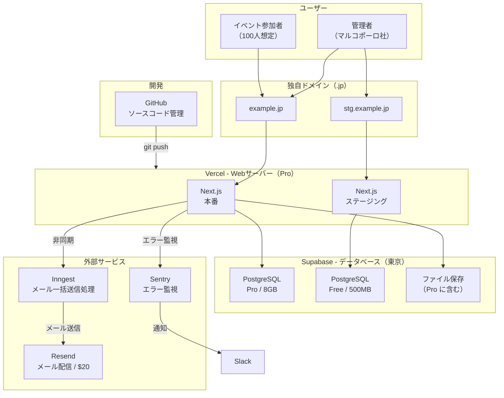
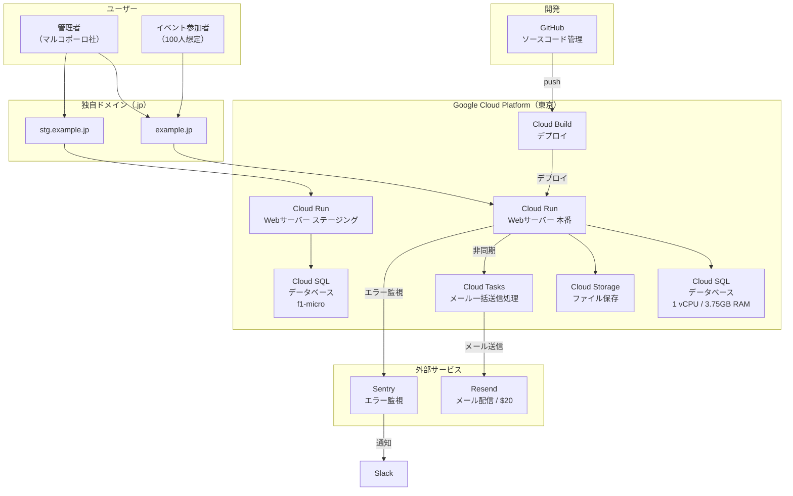

# サーバー構成見積もり

## 想定利用規模

| 項目 | 規模 |
|------|------|
| 通常利用 | マルコポーロ社の社内数人 / 1日数アクセス |
| イベント時 | 参加者100人想定 |
| メール送信 | イベント案内（再案内含む）300通/月、アンケート200通/月 |

---

## 要約

構成案を2つ検討した結果、**案1（Vercel + Supabase）を採用する**。

| 項目 | **案1（Vercel + Supabase）** | 案2（GCP） |
|------|---------------------------------------|-------------|
| **月額費用** | **約 $69（約10,400円）** | $80〜105（12,000〜15,800円） |
| **運用の楽さ** | ◎ | △ |
| **ステージング費用** | $0 | $12〜20/月 |
| **バックアップ** | 日次バックアップ（7日間） | PITR（7日間） |

### 案1 採用理由

- 運用の手間が少ない（開発者1人体制に適している）
- 月額費用が安い
- ステージング環境が実質無料
- 体感できるレベルの性能差はない

> **費用に関する注意**: 月額 約$69（約10,400円）は現時点の見積もりです。利用量の変動や各サービスの料金改定により、前後する可能性があります。

---

## 案1: サービス一覧

| サービス | 用途 | 月額費用 |
|---------|------|---------|
| **Vercel** | Webサーバー（アプリの画面を配信） | $20 |
| **Supabase** | データベース（顧客・イベント等のデータ保存） | $25 |
| **Supabase Storage** | ファイル保存（画像等） | $0（Supabaseに含む） |
| **独自ドメイン（.jp）** | Webサイトのアドレス | ~$4 |
| **Resend** | メール配信（イベント案内・アンケート等） | $20 |
| **Inngest** | メール一括送信の裏側の処理 | $0 |
| **Sentry** | エラー監視（不具合の検知・Slack通知） | $0 |
| **GitHub** | ソースコード管理・開発基盤 | $0 |
| **合計** | | **約 $69/月（約10,400円）** |

---

## 案1: 構成図

---

## 案1: 費用内訳

### 本番環境

| サービス | 構成 | 月額費用（税抜） |
|---------|------|-----------------|
| Vercel | Pro（商用利用必須） | $20 |
| Supabase | Pro（8GB DB / 250GB帯域 / 東京リージョン） | $25 |
| Supabase Storage | 100GB込み（Proに含む） | $0 |
| 独自ドメイン（.jp） | サブドメインでステージングと共有 | ~$4/月（年$40〜50） |

**本番 小計: 約 $49/月（約7,400円）**

### ステージング環境

| サービス | 構成 | 月額費用（税抜） |
|---------|------|-----------------|
| Vercel | Proに含まれる（プレビュー環境） | $0 |
| Supabase | Free（500MB DB / 東京リージョン） | $0 |

**ステージング 小計: $0/月**

### 外部サービス

| サービス | プラン | 月額費用 |
|---------|-------|---------|
| GitHub | Free | $0 |
| GitHub Actions | 無料枠内（Vercel連携で不要な場合も） | $0 |
| Resend | Pro（月50,000通 / 1日上限なし） | $20 |
| Inngest | Free（月50,000実行 / メール送信の非同期処理） | $0 |
| Sentry | Free（5,000エラー/月 / エラー監視・Slack通知） | $0 |

**外部サービス 小計: $20/月（約3,000円）**

### 合計

| 項目 | 月額費用 |
|------|---------|
| 本番 | 約 $49（7,400円） |
| ステージング | $0（0円） |
| 外部サービス | $20（3,000円） |
| **合計** | **約 $69/月（約10,400円）** |

---

## ドメイン構成

| 環境 | URL例 |
|------|-------|
| 本番 | example.jp または app.example.jp |
| ステージング | stg.example.jp |

SSL証明書は自動発行・更新。

---

## 参考: 案2（不採用）

案2: Cloud Run + Cloud SQL（東京）の詳細

GCP完結の構成。レイテンシーが最も安定するが、運用の手間とコストが案1より大きい。

### 構成図

### 費用

| 項目 | 月額費用 |
|------|---------|
| 本番 | 約 $48〜65（7,200〜9,800円） |
| ステージング | 約 $12〜20（1,800〜3,000円） |
| 外部サービス | $20（3,000円） |
| **合計** | **約 $80〜105/月（12,000〜15,800円）** |

### 不採用理由

- 運用の手間が多い（Cloud Build、Cloud Run、Cloud SQLの設定・管理）
- 月額費用が案1より高い
- 開発者1人体制ではオーバースペック

## 相談
* ドメインをどうするか