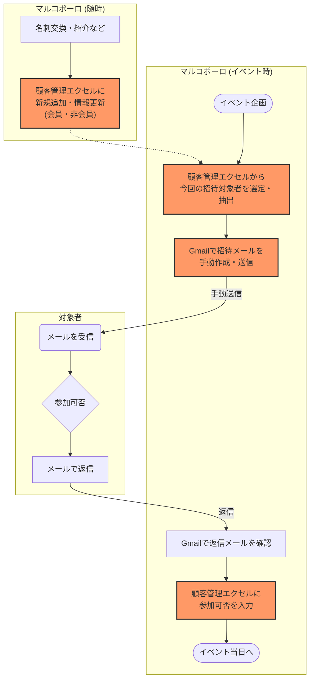

## 現状の業務フロー (As-Is)

```mermaid
flowchart TD
    %% 定義
    subgraph Daily ["マルコポーロ (随時)"]
        NewContact[名刺交換・紹介など]
        UpdateExcel["顧客管理エクセルに<br/>新規追加・情報更新<br/>(会員・非会員)"]
    end

    subgraph Admin ["マルコポーロ (イベント時)"]
        Start([イベント企画])
        SelectTarget[顧客管理エクセルから<br/>今回の招待対象者を選定・抽出]
        ComposeMail[Gmailで招待メールを<br/>手動作成・送信]
        CheckReply[Gmailで返信メールを確認]
        InputResult[顧客管理エクセルに<br/>参加可否を入力]
        Finish([イベント当日へ])
    end

    subgraph User ["対象者"]
        ReceiveMail(メールを受信)
        Decide{参加可否}
        ReplyMail[メールで返信]
    end

    %% フロー
    NewContact --> UpdateExcel
    
    %% エクセルデータがイベント管理のベースになる関係性
    UpdateExcel -.-> SelectTarget
    
    Start --> SelectTarget
    SelectTarget --> ComposeMail
    ComposeMail -- "手動送信" --> ReceiveMail
    
    ReceiveMail --> Decide
    Decide --> ReplyMail
    
    ReplyMail -- "返信" --> CheckReply
    CheckReply --> InputResult
    InputResult --> Finish

    %% スタイル調整
    classDef manual fill:#f96,stroke:#333,stroke-width:2px;
    class UpdateExcel,SelectTarget,ComposeMail,InputResult manual;
```
