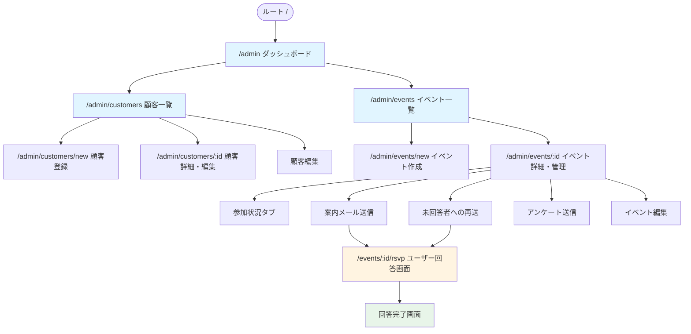
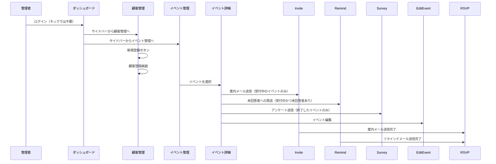
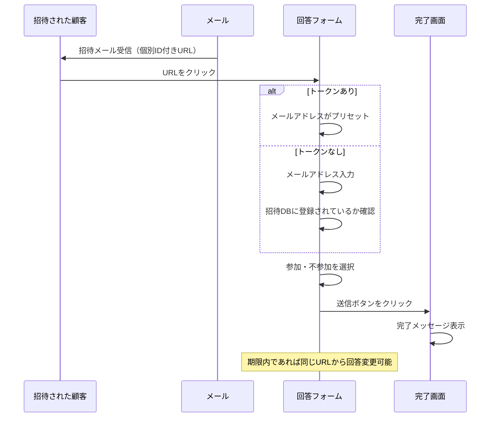

# 画面設計書

マルコポーロ合同会社の顧客管理・イベント管理システムの画面構成と遷移フロー、およびUI構成要素を定義します。

## 全体構成



## 画面一覧

### 管理者画面（認証必要）

**注意**: 現在はモックアップ段階のため、認証は実装されていますが実際のデータ保存は行われません。

| パス | 画面名 | 説明 | モックアップ |
|------|--------|------|----------|
| `/` | ルート | `/admin` へリダイレクト | ✓ |
| `/admin` | ダッシュボード | システム概要、直近のイベント一覧 | ✓ |
| `/admin/customers` | 顧客一覧 | 顧客（会員・非会員）の一覧表示、検索 | ✓ |
| `/admin/customers/new` | 顧客登録 | 新規顧客情報の登録フォーム | ✓ |
| `/admin/customers/:id` | 顧客詳細 | 顧客情報の詳細表示、過去・未来のイベント参加履歴 | ✓ |
| `/admin/customers/:id/edit` | 顧客編集 | 顧客情報の編集フォーム | ✓ |
| `/admin/events` | イベント一覧 | 過去・現在・未来のイベント一覧、検索・フィルタ | ✓ |
| `/admin/events/new` | イベント作成 | 新規イベントの作成フォーム | ✓ |
| `/admin/events/:id` | イベント詳細・管理 | イベントの詳細、参加状況、案内送信 | ✓ |
| `/admin/events/:id/edit` | イベント編集 | イベント情報の編集フォーム | ✓ |
| `/admin/events/:id/invite` | 案内メール送信 | 案内メール送信の3ステップフロー | ✓ |
| `/admin/events/:id/remind` | 未回答者への再送 | 未回答者へのリマインドメール送信の3ステップフロー | ✓ |
| `/admin/events/:id/survey` | アンケート送信 | 終了イベントの参加者へのアンケートメール送信の3ステップフロー | ✓ |
| `/admin/events/:id/survey/create` | アンケート作成・管理 | アンケート設問の追加・編集、プレビュー | ✓ |
| `/admin/login` | ログイン | メールアドレス/パスワードでログインする画面 | ✓ |
| `/admin/admins` | 管理者一覧 | 管理者アカウントの一覧表示、検索 | ✓ |
| `/admin/admins/new` | 管理者登録 | 新規管理者アカウントの登録フォーム | ✓ |
| `/admin/admins/:id/edit` | 管理者編集 | 管理者情報の編集フォーム、パスワードリセット | ✓ |
| `/admin/settings/email` | ログインID変更 | ログインに使用するメールアドレスを変更する画面 | ✓ |
| `/admin/settings/password` | パスワード変更 | ログインに使用するパスワードを変更する画面 | ✓ |

### ユーザー回答画面（認証不要・トークン認証またはメールアドレス認証）

| パス | 画面名 | 説明 | モックアップ |
|------|--------|------|----------|
| `/events/:id/rsvp` | 参加回答フォーム | 招待された顧客が参加可否を回答<br>トークンがある場合は直接参加/不参加を選択可能<br>トークンがない場合はメールアドレス入力欄が表示され、イベント参加予定DB（招待DB）に登録されている場合のみ回答可能 | ✓ |
| `/events/:id/survey/:token` | アンケート回答フォーム | イベント参加者が回答するアンケート画面。<br>会員/非会員やイベント種別による設問出し分けあり。 | ✓ |

## 画面遷移フロー

### 管理者フロー



### ユーザー回答フロー



## 画面別UI構成要素

### ダッシュボード (`/admin`)
- **表示項目**:
  - 総顧客数カウント
  - 開催予定イベント数カウント
  - 直近のイベント一覧（イベント名、開催日時、場所、参加予定人数）
  - 日付フォーマット：「2028年6月15日(月) 18:00」形式（曜日付き）
- **アクション**:
  - イベント詳細へのリンク
  - すべてのイベントを見るボタン

### 顧客管理 (`/admin/customers`)
- **表示項目**:
  - 顧客一覧テーブル（氏名、メールアドレス、所属社団法人、ステータス、登録日時）
  - 所属社団法人はバッジで表示（複数所属可能）
- **検索・フィルタ**:
  - フリーワード検索（氏名、会社名、メールアドレス）
  - 所属社団法人フィルタ（ベンチャー監査役の会、ないかんMeetup、非会員）
    - コミュニティ管理者の場合、自分の権限範囲内のコミュニティのみ表示
    - 非会員は特権管理者のみ表示可能
  - ステータスフィルタ（有効、無効）
- **権限制限**:
  - コミュニティ管理者の場合、自分の権限範囲内のコミュニティに所属する顧客のみ表示
  - 非会員は特権管理者のみ表示可能
- **アクション**:
  - 新規登録ボタン
  - 行クリックで顧客詳細へ遷移

### 顧客登録 (`/admin/customers/new`)
- **権限制限**:
  - コミュニティ管理者の場合、自分の権限範囲内のコミュニティのみ選択可能
  - 非会員は特権管理者のみ登録可能
- **入力項目**:
  - 所属社団法人（必須、ラジオボタン：非会員/会員）
  - 会員の場合：ベンチャー監査役の会、ないかんMeetupのチェックボックス（複数選択可）
    - コミュニティ管理者の場合、権限範囲内のコミュニティのみ表示（テキスト表示）
  - 氏名（必須、姓・名）
  - 氏名カナ（任意、セイ・メイ）
  - メールアドレス（必須）
  - サブメールアドレス（任意、最大3つ）
  - 会社名・所属（任意）
  - 電話番号（任意）
  - 住所（任意、郵便番号・都道府県・市区町村以下）
  - 性別（任意、男性/女性/その他）
  - 上場区分（任意）
  - 出身業種（任意）
  - 入会資格（任意）
  - 会員詳細情報（会員の場合）：
    - 会員区分（会員、スポンサー、オブザーバー）
    - 会員種別（法人、個人）
    - ベンチャー監査役の会の会員種別（正会員、オンライン会員）
    - プレミアム会員フラグ
  - 備考（任意）
- **アクション**:
  - 登録するボタン
  - キャンセルボタン

### 顧客詳細 (`/admin/customers/:id`)
- **表示項目**:
  - プロフィール情報（氏名、カナ、メールアドレス、サブメール、電話番号、会社名、住所、性別、所属社団法人・会員区分詳細、ステータス、登録日時、備考など全登録項目）
  - 開催予定のイベント一覧（イベント名、開催日時、場所、回答状況）
  - 過去のイベント一覧（イベント名、開催日時、場所、参加状況）
  - 日付フォーマット：「2028年6月15日(月) 18:00」形式（曜日付き）
- **アクション**:
  - 編集ボタン（`/admin/customers/:id/edit`へ遷移）

### 顧客編集 (`/admin/customers/:id/edit`)
- **入力項目**:
  - 顧客登録画面と同様の項目（既存値が入力済み）
- **アクション**:
  - 更新するボタン
  - キャンセルボタン

### イベント編集 (`/admin/events/:id/edit`)
- **入力項目**:
  - イベント作成画面と同様の項目（既存値が入力済み）
- **アクション**:
  - 更新するボタン
  - キャンセルボタン

### 案内メール送信 (`/admin/events/:id/invite`)
- **権限制限**:
  - コミュニティ管理者の場合、自分の権限範囲内のコミュニティの顧客のみ表示可能
  - 非会員は特権管理者のみ表示可能
- **3ステップフロー**:
  1. **案内者を選択**:
     - 顧客リスト（チェックボックス付き）
     - 全選択/全解除ボタン
     - 検索・フィルタ機能：
       - フリーワード検索（名前、会社名、メールアドレス）
       - 所属社団法人フィルタ（ベンチャー監査役の会、ないかんMeetup、非会員）
         - コミュニティ管理者の場合、自分の権限範囲内のコミュニティのみ表示
         - 非会員は特権管理者のみ表示可能
       - 会員区分詳細フィルタ（正会員、オンライン会員、スポンサー、オブザーバーなど）
       - 案内状況フィルタ（案内済み、未案内）
     - テーブル項目：選択、氏名、会社名、所属社団法人、案内状況
  2. **メール文作成**:
     - メールタイトル入力
     - メール本文入力（プレースホルダー：`{RSVP_URL}`）
     - デフォルトでイベント情報を含むテンプレートが設定される
     - テンプレート形式：
       ```
       この度は、[イベント名]にご案内いたします。

       【イベント概要】
       [概要の内容]

       【開催日時】
       [開催日時の内容（曜日付き）]

       【タイムテーブル】
       [タイムテーブルの内容]

       【場所】
       [場所の内容]

       ご参加の可否について、以下のURLよりご回答をお願いいたします。
       {RSVP_URL}

       【備考】
       [備考の内容]

       よろしくお願いいたします。
       ```
  3. **確認**:
     - イベント情報、送信先一覧、メール内容の確認
     - テスト送信ボタン、送信ボタン
- **アクション**:
  - 各ステップで「次へ」「戻る」ボタン
  - ステップインジケーター表示

### 未回答者への再送 (`/admin/events/:id/remind`)
- **3ステップフロー**:
  1. **送信先確認**:
     - 未回答者のみが表示される（固定、変更不可）
     - テーブル項目：氏名、会社名、会員区分、メールアドレス
  2. **メール文作成**:
     - メールタイトル入力
     - メール本文入力（プレースホルダー：`{RSVP_URL}`）
     - デフォルトでリマインド用のテンプレートが設定される
     - テンプレートにはイベント概要・タイムテーブル・場所・備考を含む
     - テンプレート形式：
       ```
       この度は、[イベント名]にご案内いたしました。

       【イベント概要】
       [概要の内容]

       【開催日時】
       [開催日時の内容（曜日付き）]

       【タイムテーブル】
       [タイムテーブルの内容]

       【場所】
       [場所の内容]

       まだ参加可否のご回答をいただいておりません。
       お忙しい中恐縮ですが、以下のURLよりご回答をお願いいたします。
       {RSVP_URL}

       【備考】
       [備考の内容]

       よろしくお願いいたします。
       ```
  3. **確認**:
     - イベント情報、送信先一覧、メール内容の確認
     - テスト送信ボタン、送信ボタン
- **アクション**:
  - 各ステップで「次へ」「戻る」ボタン
  - ステップインジケーター表示
- **表示条件**:
  - 受付中のイベントかつ未回答者がいる場合のみ表示

### アンケート送信 (`/admin/events/:id/survey`)
- **3ステップフロー**:
  1. **送信先を選択**:
     - イベントの参加者のみが表示される（チェックボックス付き）
     - 全選択/全解除ボタン
     - テーブル項目：選択、氏名、会社名、所属社団法人（※メールアドレス列は削除）
  2. **メール文作成**:
     - メールタイトル入力
     - メール本文入力（プレースホルダー：`{FORM_URL}`）
     - デフォルトでアンケート依頼用のテンプレートが設定される
  3. **確認**:
     - イベント情報、送信先一覧、メール内容の確認
     - 送信先一覧とメール内容はそれぞれ独立したカードコンポーネントで表示（イベント案内と同様のUI）
     - テスト送信ボタン、送信ボタン
- **アクション**:
  - 各ステップで「次へ」「戻る」ボタン
  - ステップインジケーター表示
- **表示条件**:
  - 終了したイベントのみ表示

### イベント管理 (`/admin/events`)
- **表示項目**:
  - イベント一覧テーブル（イベント種別、イベント名、開催日時、ステータス、参加予定数）
  - イベント種別はバッジ形式で表示
  - 日付フォーマット：「2028年6月15日(月) 18:00」形式（曜日付き）
- **検索・フィルタ**:
  - フリーワード検索（イベント名、場所、概要、備考）
  - イベント種別フィルタ（ベンチャー監査役の会、ないかんMeetup、その他）
    - コミュニティ管理者の場合、自分の権限範囲内のイベント種別のみ表示
    - 「その他」は特権管理者のみ表示可能
  - ステータスフィルタ（受付中、開催待ち、終了）
- **権限制限**:
  - コミュニティ管理者の場合、自分の権限範囲内のコミュニティのイベントのみ表示
- **アクション**:
  - イベント作成ボタン
  - イベント詳細へのリンク（行クリック）
  - ドロップダウンメニュー（編集、案内、アンケート送信、一時停止/再開）
  - 案内リンク：受付中のイベントのみ表示
  - アンケート送信リンク：終了したイベントのみ表示

### イベント作成 (`/admin/events/new`)
- **権限制限**:
  - コミュニティ管理者の場合、自分の権限範囲内のイベント種別のみ選択可能（テキスト表示）
- **入力項目**:
  - イベント種別（必須、プルダウン、デフォルト: ベンチャー監査役の会）
    - 特権管理者の場合：プルダウンで選択可能
    - コミュニティ管理者の場合：権限範囲内のコミュニティがテキスト表示
  - イベント名（必須）
  - 開催日時（必須、datetime-local）
  - イベント概要（任意、Textarea、高さ200px）
  - タイムテーブル（任意、Textarea、高さ200px）
  - 場所（任意、Textarea、高さ100px）
  - 備考（任意、Textarea、高さ100px）
  - 回答期限（任意、datetime-local）
  - オンライン参加を可能にする（チェックボックス）
  - 懇親会を開催する（チェックボックス）
- **アクション**:
  - 作成するボタン
  - キャンセルボタン
- **表示**:
  - 日付フォーマット：入力値はISO8601形式、表示は「2028年6月15日 18:00」形式
  - 作成後、案内メール送信フローへ進むか、後で送信するかを選択可能

### アンケート作成・管理 (`/admin/events/:id/survey/create`)
- **表示条件**:
  - イベント種別が「ベンチャー監査役の会」の場合のみ利用可能
- **機能**:
  - アンケート設問の追加・編集・削除・並び替え
  - 設問タイプ：5段階評価、テキスト入力
- **入力項目**:
  - 設問タイトル
  - 設問タイプ（Rating/Text）
  - 必須フラグ
- **アクション**:
  - 設問追加ボタン
  - 削除ボタン（ゴミ箱アイコン）
  - 並び替え（ドラッグ&ドロップまたは↑↓ボタン）
  - **プレビューボタン**: 
    - 現在の設問状態をセッションストレージに保存し、別タブで非会員向けの回答画面を開く
  - スキップしてアンケートを送るボタン
  - 保存ボタン
  - キャンセルボタン
- **備考**:
  - 固定設問（懇親会、今後の参加、入会勧誘など）はここには表示されず、回答画面でロジックに基づいて自動表示される。

### イベント詳細 (`/admin/events/:id`)
- **表示項目**:
  - イベント種別バッジ（タイトルの左側に小さいバッジで表示）
  - イベント名
  - ドロップダウンメニュー（編集、案内、未回答者に再送、アンケート送信、一時停止/再開）
- **タブ構成**:
  1. **参加状況**:
     - 参加者リストテーブル（氏名、会社名、回答ステータス、回答日時）
     - 検索・フィルタ機能：
       - フリーワード検索（氏名、会社名）
       - 受付ステータスフィルタ（参加、不参加、未回答）
     - 集計サマリ（参加/不参加/未回答数、回答受付期限、ステータスバッジ）
     - ステータスバッジは集計サマリのヘッダー右側に表示
     - 日付フォーマット：「2028年6月15日(月) 18:00」形式（曜日付き）
  2. **詳細**:
     - イベント種別、開催日時、場所、イベント概要、回答期限
     - 日付フォーマット：「2028年6月15日(月) 18:00」形式（曜日付き）
- **アクション**:
  - 「案内」リンク：受付中のイベントのみ表示（`/admin/events/:id/invite`へ遷移）
  - 「未回答者に再送」リンク：受付中かつ未回答者がいる場合のみ表示（`/admin/events/:id/remind`へ遷移）
  - 「アンケート送信」リンク：終了したイベントのみ表示（`/admin/events/:id/survey`へ遷移）
  - 「アンケート回答フォーム (会員向けサンプル)」リンク：集計サマリの下に配置（ベンチャー監査役の会イベントのみ）
  - 「アンケート回答フォーム (非会員向けサンプル)」リンク：集計サマリの下に配置（ベンチャー監査役の会イベントのみ）

### ユーザー回答画面 (`/events/:id/rsvp`)
- **表示項目**:
  - イベント情報（タイトル、日時、場所）
    - 日時は「2028年6月15日(月) 18:00」形式（曜日付き）で表示
    - 回答期限も同様に曜日付きフォーマットで表示
  - イベント詳細モーダルボタン（「イベント詳細を見る」）
    - クリックでモーダルを開き、以下を表示：
      - イベント概要
      - タイムテーブル
      - 場所
      - 備考
  - 招待客名（トークンがある場合、またはメールアドレス認証後）
- **入力項目**:
  - メールアドレス入力欄（トークンがない場合のみ表示、必須）
  - 参加/不参加ラジオボタン
  - メッセージ入力エリア（任意）
- **アクション**:
  - メールアドレス確認ボタン（トークンがない場合）
  - イベント詳細モーダルを開くボタン
  - 回答送信ボタン
  - 回答内容変更（期限内であれば同じURLから再度アクセスして変更可能）

### アンケート回答画面 (`/events/:id/survey/:token`)
- **表示条件**:
  - トークンが有効であること
- **表示項目**:
  - イベントタイトル
  - 固定設問（条件により自動表示）
    - 懇親会の出欠（イベントに懇親会がある場合）
    - 今後の参加について（全員必須）
    - ベンチャー監査役の会への入会について（ベンチャー監査役の会イベントかつ非会員の場合）
    - ご意見・ご提案・感想等（全員任意）
  - 管理者が作成した追加設問
- **アクション**:
  - 回答を送信するボタン
- **ロジック詳細**:
  - 固定設問の詳細な出し分けロジックについては `docs/アンケート出し分け表.md` を参照のこと。
  - データ読み込み中はローディング状態を維持し、「見つかりませんでした」のちらつきを防止する。

### ログインID変更 (`/admin/settings/email`)
- **入力項目**:
  - 新しいメールアドレス（必須）
- **バリデーション**:
  - メールアドレスの形式チェック
- **説明文**:
  - ログイン時に使用するメールアドレスを入力してください。
  - テストメールの送信先にもなります。
- **アクション**:
  - 変更するボタン（右寄せ）
  - キャンセルボタン（右寄せ、変更するボタンの左側）
- **備考**:
  - サイドバーの設定プルダウンメニューからアクセス可能

### ログイン (`/admin/login`)
- **入力項目**:
  - メールアドレス（必須）
  - パスワード（必須）
- **アクション**:
  - ログインボタン
- **動作**:
  - 認証成功後、顧客一覧ページへリダイレクト
  - セッション情報をlocalStorageに保存
  - 未認証でアクセスした場合は自動的にログインページへリダイレクト

### 管理者一覧 (`/admin/admins`)
- **表示条件**: 特権管理者のみアクセス可能
- **表示項目**:
  - 管理者一覧テーブル（氏名、メールアドレス、管理者種別、対象コミュニティ、最終ログイン日時、登録日時）
  - 管理者種別はバッジで表示（特権管理者、コミュニティ管理者）
  - コミュニティ管理者の場合は対象コミュニティを括弧内に表示（例: コミュニティ管理者(ベンチャー監査役の会、ないかんMeetup)）
- **検索**:
  - フリーワード検索（氏名、メールアドレス）
- **アクション**:
  - 新規登録ボタン
  - 編集ボタン（各行）

### 管理者登録 (`/admin/admins/new`)
- **表示条件**: 特権管理者のみアクセス可能
- **入力項目**:
  - 姓（必須）
  - 名（必須）
  - メールアドレス（必須）
  - パスワード（必須、12文字以上）
  - 管理者種別（必須、ラジオボタン）
    - 特権管理者
    - コミュニティ管理者
  - 対象コミュニティ（コミュニティ管理者を選択した場合のみ表示、チェックボックス）
    - ベンチャー監査役の会
    - ないかんMeetup
- **バリデーション**:
  - パスワードは12文字以上
  - コミュニティ管理者の場合は対象コミュニティを1つ以上選択
- **アクション**:
  - 登録するボタン
  - キャンセルボタン

### 管理者編集 (`/admin/admins/:id/edit`)
- **表示条件**: 特権管理者のみアクセス可能
- **入力項目**:
  - 管理者登録画面と同様の項目（既存値が入力済み）
  - 特権管理者のロールは変更不可（ラジオボタンが無効化）
- **パスワードリセットセクション**:
  - 新しいパスワード（任意、12文字以上）
  - 新しいパスワード（確認）（任意）
  - パスワードを変更する場合は両方入力が必要
- **アクション**:
  - 更新するボタン
  - 削除ボタン（確認ダイアログ付き）

### パスワード変更 (`/admin/settings/password`)
- **入力項目**:
  - 現在のパスワード（必須）
  - 新しいパスワード（必須、12文字以上）
  - 新しいパスワード（確認）（必須）
- **バリデーション**:
  - 新しいパスワードは12文字以上
  - 新しいパスワードと確認用パスワードが一致すること
  - 現在のパスワードと新しいパスワードが異なること
- **説明文**:
  - 12文字以上で入力してください。（新しいパスワードの下）
  - 確認のため、新しいパスワードを再度入力してください。（確認用パスワードの下）
- **アクション**:
  - 変更するボタン（右寄せ）
  - キャンセルボタン（右寄せ、変更するボタンの左側）
- **備考**:
  - サイドバーの設定プルダウンメニューからアクセス可能

## 関連ドキュメント
- [要件定義書](./要件定義書.md): システムの機能要件詳細
- [現状の業務フロー](./現状の業務フロー.md): システム導入前の課題と流れ
- [理想の業務フロー](./理想の業務フロー.md): システム導入後の運用イメージ
- [用語集](./用語集.md): システムで使用する用語の定義
- [モックアップ操作手順](../mockup/README.md): 開発サーバーの起動方法など
