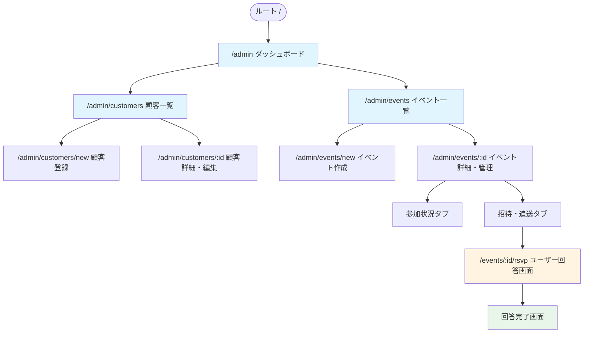
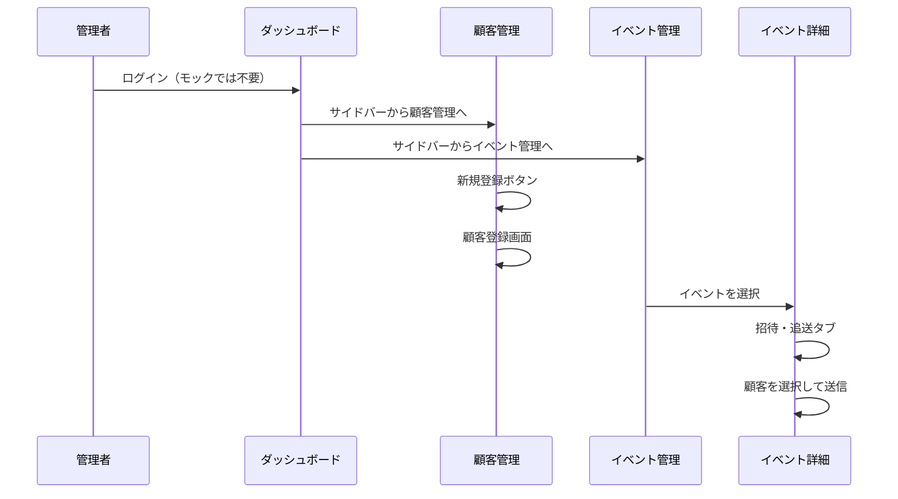
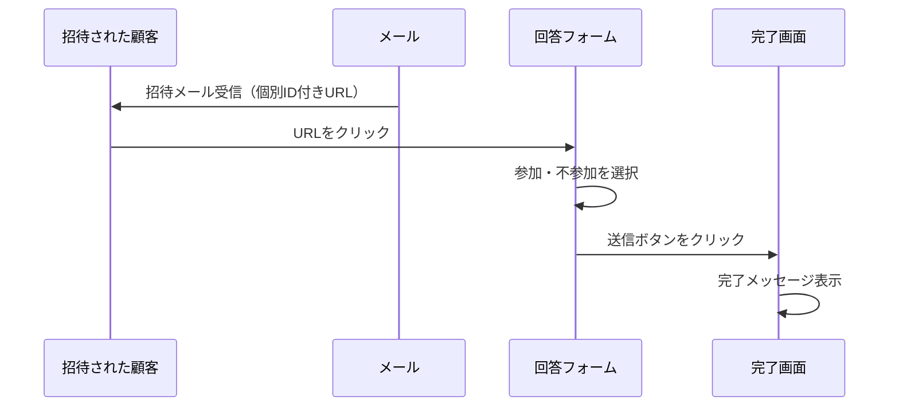

# サイトマップ

マルコポーロ合同会社の顧客管理・イベント管理システムの画面構成と遷移フローです。

## 全体構成

## 画面一覧

### 管理者画面（認証不要・モック）

| パス | 画面名 | 説明 | 実装状況 |
|------|--------|------|----------|
| `/` | ルート | `/admin` へリダイレクト | ✓ |
| `/admin` | ダッシュボード | システム概要、直近のイベント一覧 | ✓ |
| `/admin/customers` | 顧客一覧 | 顧客（会員・非会員）の一覧表示、検索 | ✓ |
| `/admin/customers/new` | 顧客登録 | 新規顧客情報の登録フォーム | ✓ |
| `/admin/customers/:id` | 顧客詳細・編集 | 顧客情報の詳細表示・編集 | 未実装 |
| `/admin/events` | イベント一覧 | 過去・現在・未来のイベント一覧 | ✓ |
| `/admin/events/new` | イベント作成 | 新規イベントの作成フォーム | 未実装 |
| `/admin/events/:id` | イベント詳細・管理 | イベントの詳細、参加状況、招待送信 | ✓ |

### ユーザー回答画面（認証不要・トークン認証）

| パス | 画面名 | 説明 | 実装状況 |
|------|--------|------|----------|
| `/events/:id/rsvp` | 参加回答フォーム | 招待された顧客が参加可否を回答 | ✓ |

## 画面遷移フロー

### 管理者フロー

### ユーザー回答フロー

## 主要な機能

### ダッシュボード (`/admin`)
- 総顧客数の表示
- 開催予定イベント数の表示
- 直近のイベント一覧（参加予定数付き）

### 顧客管理 (`/admin/customers`)
- 顧客一覧テーブル表示
- 検索機能（UIのみ、モック）
- Excelインポートボタン（UIのみ、モック）
- 新規登録ボタン

### イベント管理 (`/admin/events`)
- イベント一覧テーブル表示
- ステータス表示（受付中/企画中/終了）
- イベント作成ボタン

### イベント詳細 (`/admin/events/:id`)
- **参加状況タブ**: 参加者リストと回答状況
- **招待・追送タブ**: 顧客を選択して招待メール送信
- 集計サマリ（参加/不参加/未回答の数）
- 未回答者への再送ボタン

### ユーザー回答画面 (`/events/:id/rsvp`)
- イベント情報の表示
- 個人名の表示（トークン認証済み）
- 参加・不参加の選択
- メッセージ入力（任意）
- 送信後の完了画面

## モックアップの確認方法

1. 開発サーバーを起動: `cd mockup && npm run dev`
2. ブラウザで `http://localhost:3000/admin` にアクセス
3. サイドバーから各画面に遷移して確認

## 実装状況

- ✓ 実装済み: 主要な画面遷移とUI
- 未実装: 実際のデータベース連携、メール送信、認証機能

詳細は [mockup/README.md](mockup/README.md) を参照してください。

