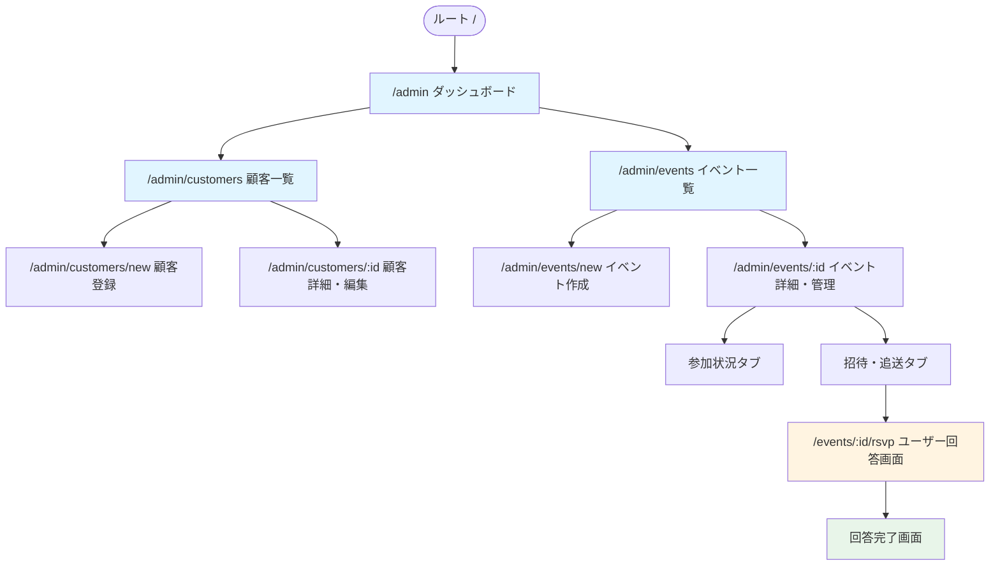
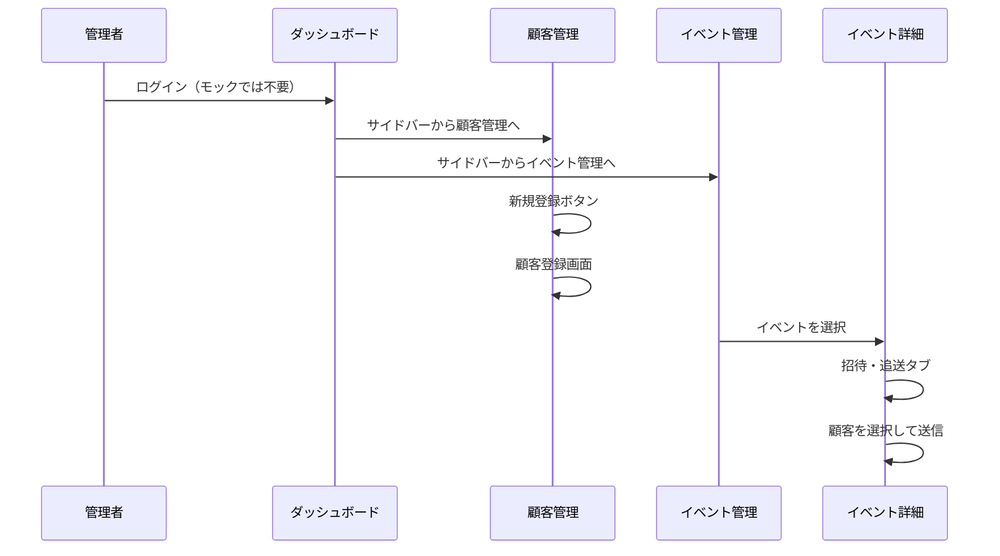
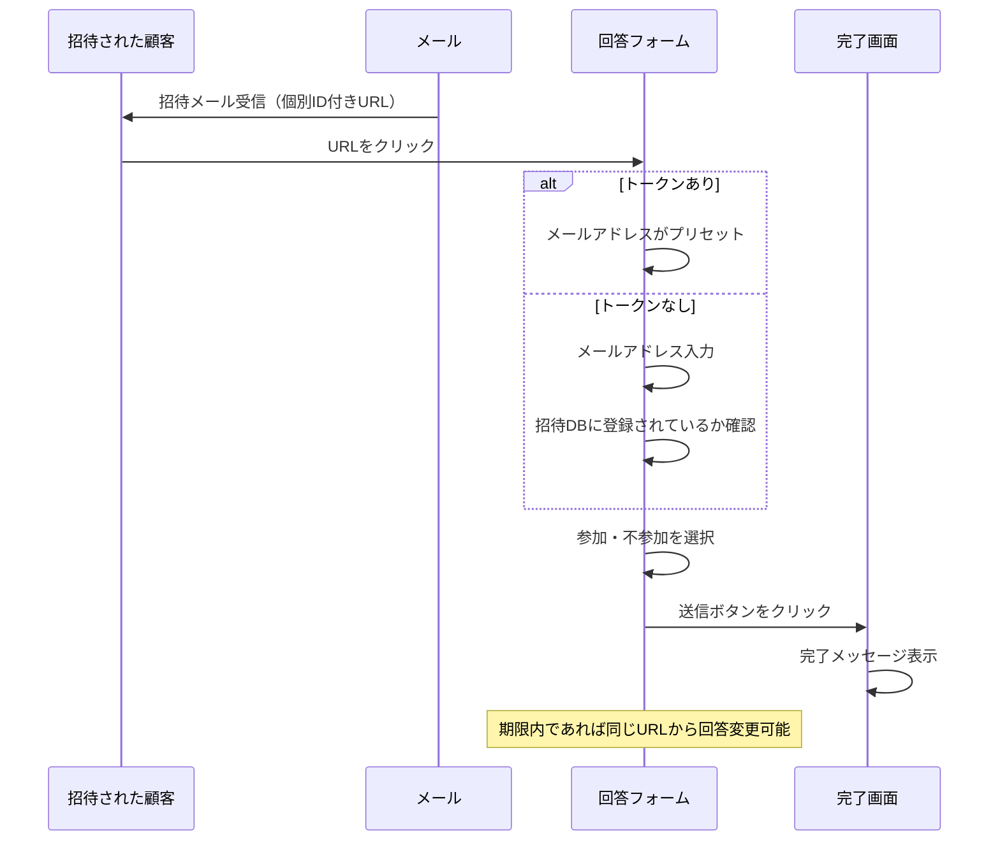

# 画面設計書

マルコポーロ合同会社の顧客管理・イベント管理システムの画面構成と遷移フロー、およびUI構成要素を定義します。

## 全体構成

## 画面一覧

### 管理者画面（認証不要・モック）

| パス | 画面名 | 説明 | モックアップ |
|------|--------|------|----------|
| `/` | ルート | `/admin` へリダイレクト | ✓ |
| `/admin` | ダッシュボード | システム概要、直近のイベント一覧 | ✓ |
| `/admin/customers` | 顧客一覧 | 顧客（会員・非会員）の一覧表示、検索 | ✓ |
| `/admin/customers/new` | 顧客登録 | 新規顧客情報の登録フォーム | ✓ |
| `/admin/customers/:id` | 顧客詳細・編集 | 顧客情報の詳細表示・編集 | 未 |
| `/admin/events` | イベント一覧 | 過去・現在・未来のイベント一覧 | ✓ |
| `/admin/events/new` | イベント作成 | 新規イベントの作成フォーム | ✓ |
| `/admin/events/:id` | イベント詳細・管理 | イベントの詳細、参加状況、招待送信 | ✓ |

### ユーザー回答画面（認証不要・トークン認証またはメールアドレス認証）

| パス | 画面名 | 説明 | モックアップ |
|------|--------|------|----------|
| `/events/:id/rsvp` | 参加回答フォーム | 招待された顧客が参加可否を回答 トークンがある場合は直接参加/不参加を選択可能 トークンがない場合はメールアドレス入力欄が表示され、イベント参加予定DB（招待DB）に登録されている場合のみ回答可能 | ✓ |

## 画面遷移フロー

### 管理者フロー

### ユーザー回答フロー

## 画面別UI構成要素

### ダッシュボード (`/admin`)
- **表示項目**:
  - 総顧客数カウント
  - 開催予定イベント数カウント
  - 直近のイベント一覧（イベント名、開催日、場所、参加予定人数）
- **アクション**:
  - イベント詳細へのリンク
  - すべてのイベントを見るボタン

### 顧客管理 (`/admin/customers`)
- **表示項目**:
  - 顧客一覧テーブル（ID、氏名、会社名、会員区分、ステータス、登録日）
- **アクション**:
  - 検索フォーム（テキスト入力）
  - 新規登録ボタン
  - 編集・詳細ボタン（各行）

### 顧客登録 (`/admin/customers/new`)
- **入力項目**:
  - 会員区分（必須、ラジオボタン：非会員/会員）
  - 会員の場合：監査役協会、ないかんMeetupのチェックボックス（複数選択可）
  - 姓（必須）
  - 名（必須）
  - セイ（必須）
  - メイ（必須）
  - メールアドレス（必須）
  - 会社名・所属（任意）
  - 電話番号（任意）
  - 備考（任意）
- **アクション**:
  - 登録するボタン
  - キャンセルボタン

### イベント管理 (`/admin/events`)
- **表示項目**:
  - イベント一覧テーブル（イベント名、開催日、場所、ステータス）
- **アクション**:
  - イベント作成ボタン
  - イベント詳細へのリンク

### イベント作成 (`/admin/events/new`)
- **入力項目**:
  - イベント名（必須）
  - 開催日時（必須、datetime-local）
  - 場所（必須）
  - 詳細説明（任意）
  - 回答期限（任意、datetime-local）
- **アクション**:
  - 作成するボタン
  - キャンセルボタン

### イベント詳細 (`/admin/events/:id`)
- **タブ構成**:
  1. **参加状況**:
     - 参加者リストテーブル（氏名、会社名、回答ステータス、回答日時）
     - 集計サマリ（参加/不参加/未回答数、回答受付期限）
  2. **招待・追送**:
     - 招待候補者リスト（チェックボックス付き）
     - 「招待メール送信」ボタン
     - 「未回答者に再送」ボタン
     - 「参加回答フォーム」ボタン（デモ用）

### ユーザー回答画面 (`/events/:id/rsvp`)
- **表示項目**:
  - イベント情報（タイトル、日時、場所）
  - 招待客名（トークンがある場合、またはメールアドレス認証後）
- **入力項目**:
  - メールアドレス入力欄（トークンがない場合のみ表示、必須）
  - 参加/不参加ラジオボタン
  - メッセージ入力エリア（任意）
- **アクション**:
  - メールアドレス確認ボタン（トークンがない場合）
  - 回答送信ボタン
  - 回答内容変更（期限内であれば同じURLから再度アクセスして変更可能）

## 関連ドキュメント
- [要件定義書](./要件定義書.md): システムの機能要件詳細
- [現状の業務フロー](./現状の業務フロー.md): システム導入前の課題と流れ
- [理想の業務フロー](./理想の業務フロー.md): システム導入後の運用イメージ
- [モックアップ操作手順](../mockup/README.md): 開発サーバーの起動方法など
